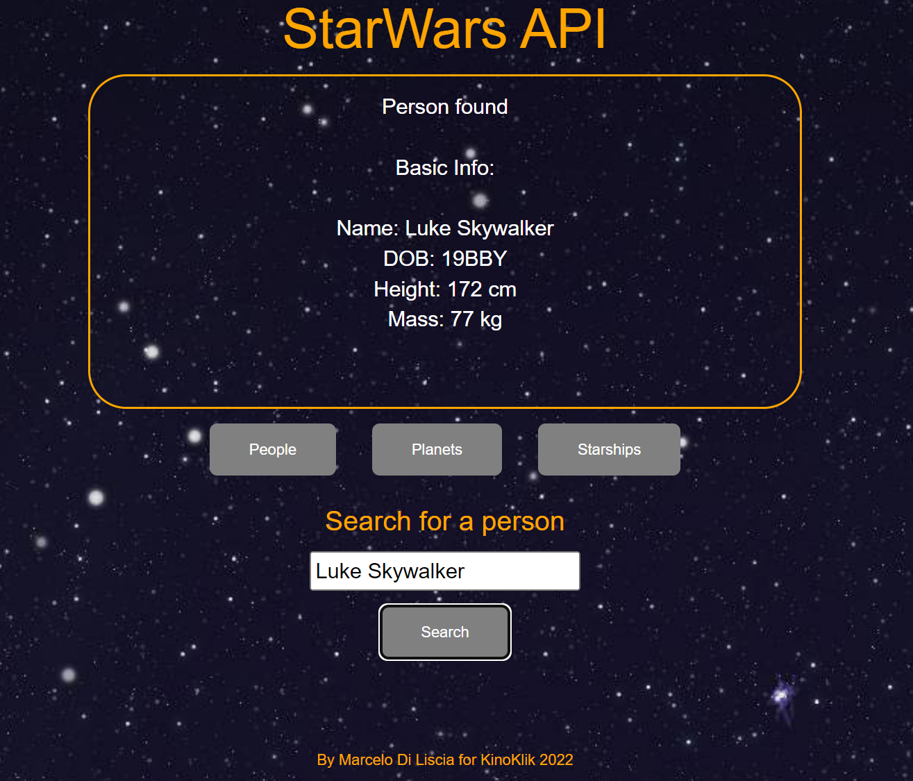

# StarWarsAPI
## Developer Aptitude Test
With the use of the provided API endpoint create an application to present the user
with an interactive user interface.
###The application should support the following features:
1. A user can view a list of people.
2. A user can view a list of planets.
3. A user can view a list of starships.
4. A user can search for a person.
5. 
##Requirements
1. Use the following as your online API: https://swapi.dev/documentation
2. The API above should be wrapped in a backend REST API client with the 4
endpoints required for the use cases above.
3. The UI should preferably work as a no-refresh, Single Page Application. Use
of a JS Framework is recommended (React, Vue, Angular...) , but not
mandatory in case embedded PHP,Ruby or any other language is preferred.

##Instructions
● Use the Backend programming language and/or framework solution of your
choice.
● You can also use any Javascript library or plugin you desire (or none at all!).

