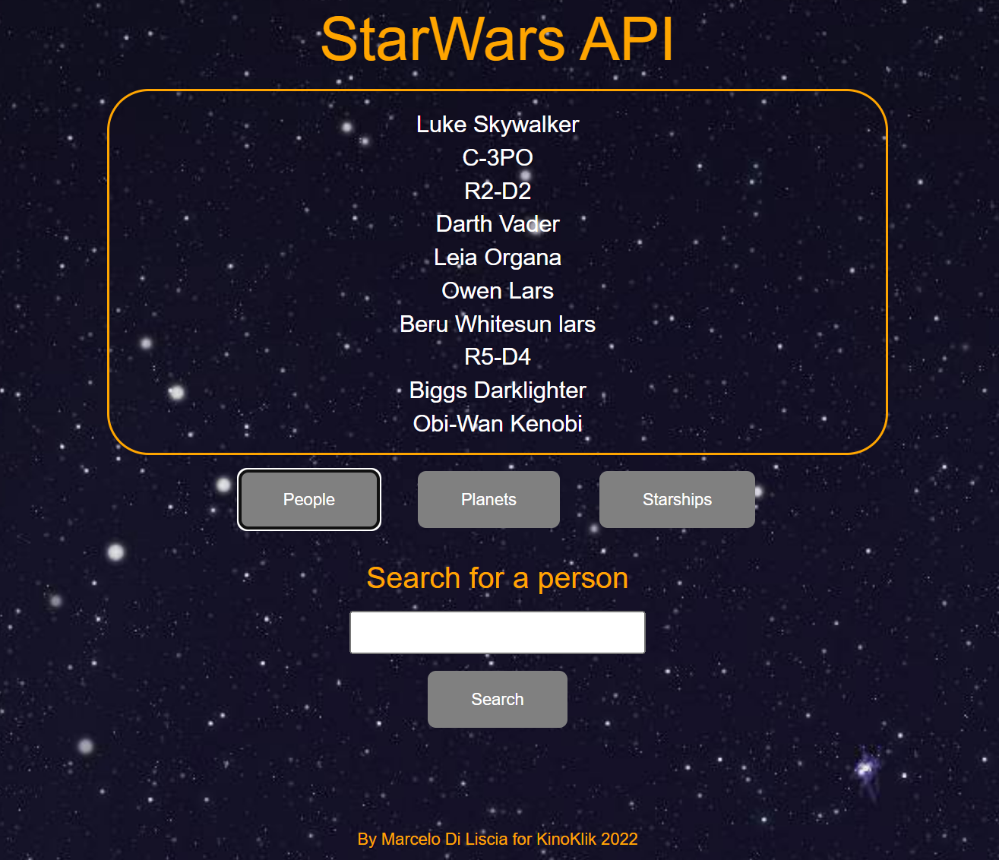

# StarWarsAPI

## Developer Aptitude Test
With the use of the provided API endpoint create an application to present the user
with an interactive user interface.

### The application should support the following features:

1. A user can view a list of people.
2. A user can view a list of planets.
3. A user can view a list of starships.
4. A user can search for a person.
 
## Requirements

1. Use the following as your online API: https://swapi.dev/documentation
2. The API above should be wrapped in a backend REST API client with the 4
endpoints required for the use cases above.
3. The UI should preferably work as a no-refresh, Single Page Application. Use
of a JS Framework is recommended (React, Vue, Angular...) , but not
mandatory in case embedded PHP,Ruby or any other language is preferred.

## Instructions to run the aplication:

- Download the whole folder StarWarsAPI in your computer. You can clone the repository or ask to open it using GitHub Desktop.

- Use an editor (like Visual Studio Code or Intellij Idea) to open the folder.

- Look for the index.html file located in ..src/main/java/ and Run the project.

- The People button shows the list of people, the Planets button the list of planets and the StarShips button shows the list of ships.

- To search for a person you must write the name in the text box and click on Search.

#### StarWars API User Interface main:

#### Person List:

#### Person Search:

